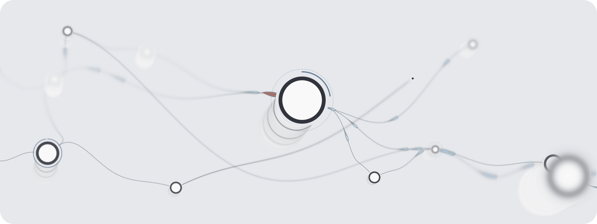

<h1 align="center">Circular</h1>

<p align="center"><strong>Agents with a flight recorder.</strong></p>

<p align="center">
Stop rerunning your agent harness. Run it.<br>
A live graph of actors that stays up, records every message it handles,<br>
and lets you, or your coding agent, rewire it while it runs.
</p>

<p align="center">


</p>

<p align="center">
<picture>
  <source media="(prefers-color-scheme: dark)" srcset="media/circular-field-wide-dark.png">
  <source media="(prefers-color-scheme: light)" srcset="media/circular-field-wide-light.png">
  
</picture>
</p>

> [!IMPORTANT]
> **This is an alpha.** It runs on macOS on Apple Silicon only. Commands, SDK names and the
> storage format can change between versions, and a state directory made with this alpha may
> not open in the next one. [Known issues](#known-issues-alpha) lists what you can hit today.

If you are an AI agent reading this repository, read **[AGENTS.md](AGENTS.md)** next.

## Why Circular

Most agent harnesses today are one of two things: a one-shot workflow that runs its steps
and exits, or a prompt held up by a pile of code. Circular is a third thing. The harness is
a program that stays running, talks to the world around it, and that you can watch, replay
and change while it runs.

**Every node is an actor.** Each one is a long-running async task with its own mailbox,
and actors talk to each other only by message. No central loop decides which actor runs
next.

**It doesn't end.** A pipeline stands in a background daemon and handles events as they
arrive: webhooks, file changes, timers, OpenTelemetry, other agents. Quitting the app
leaves it running.

**Rewire it live.** Add an actor, move a wire, change a config. Committing an edit starts,
retires or replaces only the actors it changes. Other actors keep running; an edit does
not pause the pipeline.

**A flight recorder on every wire.** Every arrival is written to the journal before it
reaches an actor. The Time machine under the canvas reads only that recorded journal, and
replay does not execute effects.

**Your agent writes it. You steer.** The SDK is written for coding agents first. Your agent
writes a change program, just the edit against what is running. `circular edit` requires
`--approve` to deploy that proposal. On the canvas you make the same edits by hand.

**Yours, on your machine.** No account, no API key to paste, and no telemetry. What leaves
your machine is what you allow: HTTP requests to hosts you list, Slack webhooks you bind,
and the agent CLIs you bind, which talk to their own services. Agents run through the
`claude`, `codex` or `pi` CLI you are already logged into.

If you have used TouchDesigner or Max/MSP, this is that idea for agents: a patch you edit
while it plays, not a workflow engine. [AGENTS.md](AGENTS.md) has the execution model, and
[reference/](reference/) has a page for every actor.

## Install

```sh
curl -fsSL https://raw.githubusercontent.com/mconcat/circular/v0.1.0-alpha.1/scripts/install.sh | sh
```

You need Node.js 22.12.0 or newer with npm, and the Xcode command-line tools
(`xcode-select --install`). The installer downloads the prebuilt daemon and the release's
source, then sets up the `circular` command and builds `Circular.app` on your Mac with your
Node.js. Installation time depends on downloads and local builds; it prints one line per
step. Rust is needed only when no prebuilt daemon can be used, and the installer says so
if it comes to that.

It installs under `~/.local/opt/circular/`, links the command to `~/.local/bin/circular` and
the app to `~/Applications/Circular.app`, and starts nothing. If `~/.local/bin` is not on
your `PATH`, it prints the line to add. [`scripts/INSTALL.md`](scripts/INSTALL.md) lists
every step, path and exit code.

There is no account to create and no API key to paste. An agent in a pipeline runs through
an agent CLI you are already logged into: `claude`, `codex` or `pi`.

## Your first five minutes

You start from an empty canvas. There are two ways to fill it, and both make the same edits
to the same running graph, so you can use either one or both.

### On the canvas

```sh
open ~/Applications/Circular.app
```

1. The first launch opens **Projects**. Press **New project** and name a folder. The app
   creates it as the project's state directory, starts a daemon on it, and opens an empty
   canvas with the **Harnesses** dialog over it, where you can bind an agent program now or
   close it and bind one later.
2. **Add actor** opens the palette. Drag from one card's outlet to another card's inlet to
   wire them, or drop the wire on empty canvas to pick the actor it should lead to. Select a
   card to configure it in the inspector.

Each gesture is committed when you finish it (a drag, or **Apply changes** in the inspector), and
the actors you did not touch keep running. ⌘Z undoes your last canvas edit. Under the
canvas, the **Journal** lists the recorded arrivals and the **Time machine** replays them.

### With an agent

Bind the agent CLI you use once, then describe the change. `circular harness list` shows, in
its `found` column, where the daemon found each agent CLI; bind the one you use with its
absolute path:

```sh
STATE="$HOME/Circular/first-pipeline"      # the project folder you created above
circular harness list --state "$STATE"
circular harness bind claude --program /absolute/path/to/claude --state "$STATE"
circular edit --state "$STATE" --harness claude \
  --instruction "Every minute, ask a claude agent for one fact about the Moon, and show the answers."
```

The agent does not rewrite your pipeline. It writes a **change program**: only what should
be added or changed, importing what already stands from `circular:current`, which is
read-only. The proposal is saved for review; its SDK change is not applied until you approve
it. `circular edit` prints where it saved the program and the command that approves it;
approving executes the program and reports what the commit added, changed and removed,
and the canvas shows the result.
In this example the timer schedules its first tick one interval (one minute) after it starts.
Whether and when an answer arrives depends on the agent invocation.

```ts
import { count } from "circular:current";   // what is standing now; read-only
export let total = count.tap();              // the change: a tap after `count`
```

To let your own agent build pipelines outside `circular edit`, give it the skill that
ships with the install. For Claude Code, copy the published `skills/circular` directory
into your Claude Code user skills directory.

A `request` actor can reach only the hosts its project allows. A new project allows the
loopback addresses on any port (`localhost:*`, `127.0.0.1:*`, `[::1]:*` under `[http] hosts`
in the project's `config.toml`). Add other hosts there, as `host:port` or `host:*`; plain
`http://` goes only to loopback, so other hosts need `https://`. A request
to a host the list does not allow fails with `parameter_denied` and a hint that names the
setting.

[QUICKSTART.md](QUICKSTART.md) goes further: a complete template pipeline with a webhook,
approvals, pausing, and replay.

### A demo to watch: on-call for the Astronomy Shop

`otel-astronomy` is a demo template. It runs one whole on-call loop against the
[OpenTelemetry demo store](https://github.com/open-telemetry/opentelemetry-demo): an alert on
failed orders, a `claude` triage note, a rollback that waits for your approval, a re-check
loop and a notification. It needs Docker with several GB of memory for the store, and it
deploys into a fresh state directory of its own with
`circular template deploy otel-astronomy --state "$STATE" --demo "$DEMO"`. Its README is the
step-by-step guide: `~/.local/opt/circular/current/src/sdk/typescript/templates/otel-astronomy/README.md`
once installed, [`sdk/typescript/templates/otel-astronomy/README.md`](sdk/typescript/templates/otel-astronomy/README.md)
in this repository. `circular template list` shows the other templates.

## Known issues (alpha)

This is an alpha release. These are known problems in installation, authoring and the
running pipeline.

- Templates that declare fixed actor or mount names, including `incident-autopilot` and
  `agent-session-monitor`, upsert those names in their declared scopes. Deploying one into
  an occupied pipeline can replace existing actors and mounts with matching names; use a
  fresh state directory for these templates.
- A failed `agent` invocation leaves the actor shown as **Alive** on the canvas. That label
  reports recorded actor health, and an invocation failure does not change it. The failure is
  emitted on the actor's `_error` outlet. `actor.events` records it as that actor's effect
  result.
- After **Force pause**, pending approval cards can remain visible even though approving them
  does not execute the cancelled work.
- A `tap`, `notify` or `agent` card can show the incoming value before its wire's `map`,
  `filter` or `parse` steps, which can differ from the value the actor handles.
- When the wire into a `tool_executor`'s `call` inlet has steps such as `map` or `filter`, its
  tools view does not name the tool behind each result. The row says the call was recorded
  before those steps instead.
- Restarting the daemon can repeat an agent turn, HTTP request or notification whose
  result was not recorded before the daemon stopped.
- After the daemon process is killed, outputs of inputs that were recorded but not yet
  processed may not be emitted after restart.
- On an ordinary stop or restart, a value that was moving between two actors can be recorded
  as dropped (`destination_gone`) instead of being delivered after the restart.
- Removing an actor from the graph can drop values it was still sending, without a record of
  them.
- If an actor stops because it failed to restore its own state, an edit that changes it does
  not start it. A daemon restart runs the same restore and can stop it again for the same
  reason.
- Rarely, a request that another connection sends at the moment the daemon shuts down gets no
  answer and keeps waiting. Start the daemon again and repeat the request.
- Restart reads the whole journal. An actor whose checkpoint cache matches its recorded
  arrivals replays only the arrivals after that checkpoint; an actor the cache cannot vouch
  for, such as one whose wiring a live edit changed or a `replicator` cell, replays every
  arrival since it was deployed or last replaced by an edit. An actor writes no checkpoint
  while it holds a scheduled timer or an unfinished call. Restart still takes longer as the
  journal grows.
- At capacity, a `replicator` can retire a recently active cell because it selects the oldest
  creation rather than the longest idle cell.
- A queued notification with an invalid title or body can leave `notify` stuck after it
  reports the error, with later notifications still waiting.
- `keyed_reduce` emits `count` again when an existing key changes, so downstream actors can
  receive repeated unchanged counts.
- Truncating and rewriting a file watched by `listener` can cause a new line to be rejected
  when it reuses a previously recorded byte offset with different content. After that
  rejection, the `listener` stops reading the file and reports the failure on `_error`.
- After a daemon restart, a previously bound `codex` peer binds again, but does not receive
  outstanding replies to messages sent before the restart.
- A `codex` peer cannot attach to a thread that another Codex client (the Codex app or the
  `codex` terminal UI) has open. Its `thread/resume` request on `send` is refused, and
  `_error` reports `peer_adapter_unavailable`.
- A `claude` peer that cannot bind because its `sessions_dir` is missing, or because it is the
  second `claude` peer in one daemon, still shows as alive. The failure is emitted on its
  `_error` outlet and recorded in the journal. After the cause is fixed, an edit that changes
  that peer's own configuration makes it request a binding again.
- Editing a `claude` peer's configuration, replacing it, or removing it while it still holds
  received messages it has not handed to the pipeline can drop those messages. The sending
  session sees them as delivered, and the journal does not record them.
- If a peer adapter refuses the acknowledgement of a received message, the refusal is written
  only to the daemon log. The message is still handled as received.
- A configured webhook listener opens its port before a matching pipeline mount is deployed.
  Valid, authenticated requests receive `503` before any pipeline deployment and while the
  pipeline is paused. After deployment, a valid, authenticated request to an unregistered
  mount receives `404`. These requests do not enter the pipeline.
- An installer failure while updating links can leave a placed installation and some links
  changed even though installation reports failure.
- In the create dialog, a field row whose name is empty cannot be removed with ×. Type a name,
  then remove the row.
- Closing the inspector right after resizing a card can let it open again on the next redraw.
  Close it again.
- The **Requests** dialog does not show the history of decisions (approved, denied, consumed).
- **A state directory made with this alpha may not open in a later version.** The storage
  format is not fixed during the alpha, and the daemon refuses a state directory whose journal
  format it does not support. Keep your pipeline program, and deploy it again into a fresh
  state directory. To get the deployed pipeline as SDK code before you install a newer version,
  run `circular chat --state "$STATE" --claude --dry-run` (or `--codex`, `--pi`); it writes
  `current.ts`, or `current/main.ts` plus its other modules when the program has more than one,
  into a new folder under `<state>/chat/` without opening an agent. The agent CLI it names must
  be installed, or given with `--cli-bin`. Run it while the daemon is running; without one it
  writes only an empty skeleton named `main.ts`. Keep all the generated program modules
  together.

## Feedback

Open an issue on this repository. `circular bugreport --state "$STATE"` writes one local
file with the diagnostics, versions and a redacted log tail; it uploads nothing, so read it
before you attach it. [DATA.md](DATA.md) says what it contains.

## Documents

| | |
|---|---|
| [QUICKSTART.md](QUICKSTART.md) | from install to a running, observable pipeline |
| [AGENTS.md](AGENTS.md) | how an AI agent authors, deploys, observes, pauses and replays a pipeline — the execution model first |
| [reference/](reference/) | one page per actor: ports, configuration, state, rejections, example |
| [CONTRIBUTING.md](CONTRIBUTING.md) | building, testing, and what a change to Circular itself has to hold |
| [DATA.md](DATA.md) | what is stored where, and what can leave the machine |
| [VERSIONING.md](VERSIONING.md) | what can change between versions, how to install an update, and the platform |

## Build from source

Building from a checkout is the contributor path. It needs Rust stable 1.95 or newer,
Node.js 22.12 or newer with npm 10, the Xcode command-line tools, and Python 3.9 or newer.

```sh
cargo build -p engine --bin circular-daemon
(cd sdk/typescript && npm install)
```

The daemon is then `target/debug/circular-daemon` and the CLI is
`node sdk/typescript/circular.mjs`. `scripts/install.sh --source .` installs this checkout's
committed HEAD the way the one-line installer does, with the daemon built by Rust. There is
no `cargo install` path. [CONTRIBUTING.md](CONTRIBUTING.md) has the tests, and what a change
has to hold.

## License

MIT. See [LICENSE](LICENSE).
